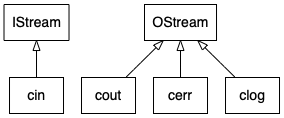

# From 0 to 1: __cin__ and __cout__

## 0%: 输入输出对象

标准库提供了4个标准IO对象
### 图示

### 表格表示
| 概念名称 | 库对象/函数名 | (父)类型 | 名称空间|
| ---     | ---- | ---| --- |
|标准输入 | **cin** | istream| std|
|标准输出 | **cout** | ostream| std|
|标准错误 | **cerr** | ostream| std|
|标准日志 | **clog** | ostream| std|

## 10%: 从 **istream** 和 **ostream** 说起
### stream(流) === \['a','b','c'...'z'\](字符序列)

## 50%: 代码实例
```
#include <algorithm>
#include <iostream>
using namespace std;

int main(){
    std::cout << "Enter two numbers:" << std::endl;
    auto v1 = 0, v2 = 0;
    std::cin >> v1 >> v2;
    std::cout << "The sum of " << v1 << " and " << v2
                << " is " << v1 + v2 << std::endl;
    return 0;
}
```